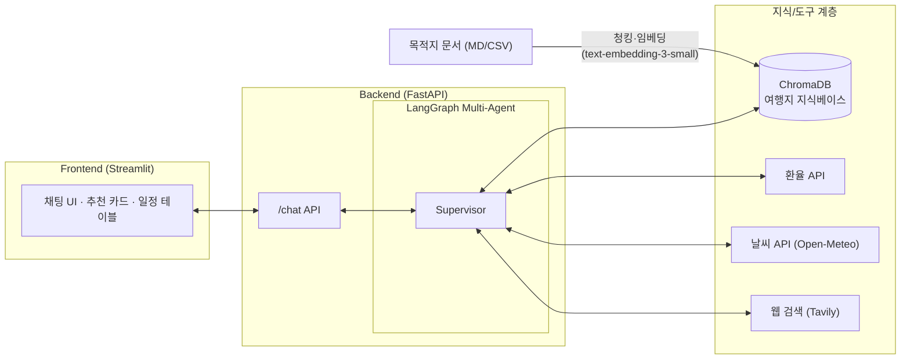
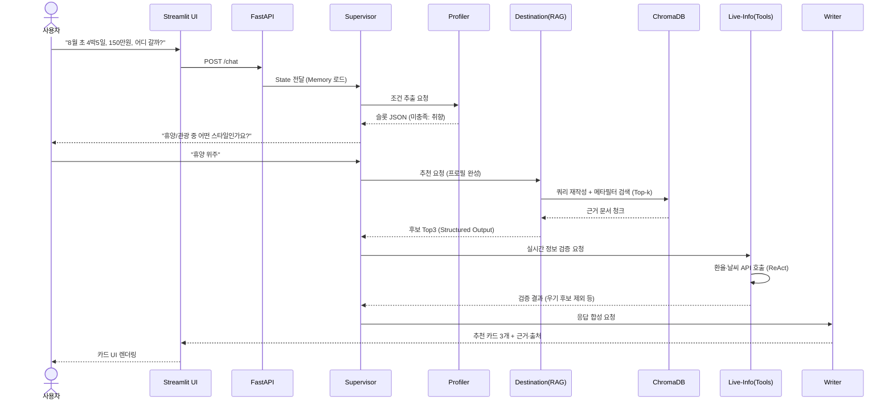

# 언제어디로 (When&Where) – 시기 기반 해외여행 추천 AI Agent

> AI Bootcamp 최종 과제 기획·설계 문서
> 작성자: (이름 기입)

---

## 1. 프로젝트 개요 – 기획 배경 및 핵심 내용

### 1.1 프로젝트 기획 배경

**어떤 문제를 해결하고자 하는가?**

대부분의 직장인·학생에게 여행 계획의 출발점은 "목적지"가 아니라 **"날짜"**다.
"7월 말에 5일 휴가가 나왔는데, 이때 어디를 가야 좋을까?"가 실제 질문인데,
기존 여행 서비스(스카이스캐너, 트리플, 마이리얼트립 등)는 모두 **목적지를 이미 정한 사람**을
위한 도구(항공권/숙소/일정 검색)로 설계되어 있다.

- 7월 말의 동남아는 우기이고, 유럽은 극성수기라 물가가 2배다 — 이런 **시기 × 지역 적합도** 정보는
  블로그 수십 개를 뒤져야 겨우 조합할 수 있다.
- 우기/건기, 축제 시즌, 성수기 물가, 비자 요건, 비행시간, 시차, 안전 정보가
  **전부 다른 곳에 파편화**되어 있어 비교 자체가 어렵다.

**기존 방식의 한계**

| 기존 방식 | 한계 |
|---|---|
| 포털/블로그 검색 | 정보 파편화, 광고성 콘텐츠 다수, 시기별 비교 불가 |
| OTA (스카이스캐너 등) | 목적지 선정 이후에만 유용, "언제 가면 좋은지" 답 못함 |
| 일반 LLM 챗봇 (ChatGPT 등) | 환율·날씨 등 실시간 정보 없음, 근거 없는 환각 응답, 일회성 답변 |

**Agent 서비스로 해결할 수 있는 Pain Point**

1. **탐색 비용**: 여러 후보지의 시기 적합도를 사람이 일일이 조사 → Agent가 RAG 지식베이스에서 일괄 검색·비교
2. **정보 신뢰성**: LLM 단독 환각 → RAG 근거 + 실시간 API(환율/날씨) Tool Calling으로 보강
3. **의사결정 단절**: 목적지 추천 → 일정 설계 → 실용 정보 확인이 각각 다른 서비스 → Multi-Agent가 하나의 대화 흐름으로 연결

**프로젝트 동기**

"휴가 날짜는 정해졌는데 어디 갈지 못 정해서 검색만 며칠씩 하는" 매우 보편적인 경험에서 출발했다.
이 문제는 (1) 조건 이해 → (2) 지식 검색 → (3) 비교·추론 → (4) 계획 생성이라는 다단계 작업이라
단일 프롬프트로는 품질 확보가 어렵고, **역할 분담된 Multi-Agent + RAG 구조가 실질적 우위를 갖는 주제**다.

### 1.2 핵심 아이디어 및 가치 제안 (Value Proposition)

**핵심 기능**

1. **시기 기반 목적지 추천**: 여행 시기(월/기간), 예산, 동행, 취향(휴양/관광/미식/액티비티)을 입력하면
   해당 시기의 기후·물가·축제·비행시간을 종합 점수화하여 목적지 Top 3를 근거와 함께 추천
2. **맞춤 일정 설계**: 선택한 목적지에 대해 일자별 상세 일정(Day Plan) 자동 생성
3. **실시간 실용 정보**: 환율·날씨 예보·비자 요건을 Tool Calling으로 조회해 응답에 결합
4. **대화형 조건 정제**: 부족한 조건은 Agent가 되물어 슬롯을 채우고, 대화 Memory로 조건 변경("예산을 150으로 올리면?")에 즉시 재추천

**사용자 가치·기대효과**

- 목적지 선정에 걸리는 탐색 시간을 수 시간~수 일 → **수 분으로 단축**
- "왜 이 목적지인가"에 대한 **근거 있는 추천** (계절 적합도, 물가 수준, 축제 등 출처 기반)
- 추천 → 일정 → 실용정보까지 **한 번의 대화 흐름**으로 완결

**기존 서비스 대비 차별성**

- OTA와 반대 방향의 설계: **"날짜 → 목적지"** 역방향 추천 (기존: 목적지 → 날짜/상품)
- 일반 챗봇과 달리 **자체 여행지 지식베이스(RAG) + 실시간 API**로 검증 가능한 응답
- 단일 답변이 아닌 **구조화된 추천 카드(Structured Output)** — 점수, 예산, 최적 시기, 주의사항 필드 고정

### 1.3 대상 사용자 및 기대 사용자 경험 (UX)

**주요 타겟**

- 1순위: 휴가 일정은 확정됐지만 목적지를 못 정한 **20~40대 직장인**
- 2순위: 방학·연휴 시즌 여행을 계획하는 학생·가족 단위 여행자

**사용자 흐름과 경험**

1. 채팅 UI에서 자연어로 요청 → "8월 초에 4박 5일, 200만 원, 휴양 위주로 가고 싶어"
2. Agent가 부족한 조건(출발지, 동행 등)을 질문해 프로필 완성
3. 추천 카드 3개 제시 — 목적지별 적합도 점수, 추천 이유, 예상 경비, 날씨/환율 실시간 정보
4. 목적지 선택 시 일자별 일정표 생성, 조건 변경 시 대화 맥락 유지한 채 재추천
5. 최종 일정은 Markdown 리포트로 다운로드

**구체적 Benefit**

- 검색·비교 노동 제거, 시기별 리스크(우기·혹서·극성수기) 사전 인지
- 근거·출처가 붙은 추천으로 의사결정 확신도 향상
- 조건을 바꿔가며 시뮬레이션하는 대화형 탐색 경험

---

## 2. 기술 구성 – 서비스에 적용할 기술 스택

### 2.1 Prompt Engineering 전략

| 전략 | 적용 내용 |
|---|---|
| **역할 기반 프롬프트** | Agent별 System Prompt 분리 — "당신은 15년 경력의 여행 컨설턴트로, 계절·기후 데이터에 근거해서만 추천합니다" 등 역할·제약·톤 명시 |
| **CoT (Chain-of-Thought)** | 추천 Agent가 `후보 목록 → 시기 적합도 평가 → 예산 필터 → 취향 가중치 → 최종 순위` 단계로 사고하도록 추론 단계를 프롬프트에 명시 |
| **Few-shot** | 조건 추출(자연어 → JSON 슬롯)과 추천 카드 작성에 입출력 예시 2~3개 포함해 형식 일관성 확보 |
| **출력 구조화 템플릿** | 추천 결과를 Pydantic 스키마(목적지, 점수, 이유, 예상경비, 최적시기, 주의사항)로 강제 |
| **상황별 프롬프트 분기** | 조건 미충족 시 → 질문 프롬프트 / 조건 충족 시 → 추천 프롬프트 / 여행과 무관한 질문 → 정중한 범위 안내 프롬프트로 분기 |

### 2.2 LangChain / LangGraph 기반 Agent 구조

**설계 개념**: LangGraph **Supervisor 패턴** 기반 Multi-Agent. Supervisor가 상태(State)를 보고
다음 작업 Agent로 라우팅하며, 각 Worker Agent는 자기 도구만 사용하는 전문가로 동작.

| Agent | 역할 (Role) | 사용 기술 |
|---|---|---|
| **Supervisor** | 사용자 의도 분류, 상태 기반 라우팅, 종료 판단 | LangGraph StateGraph, 조건부 엣지 |
| **Profiler Agent** | 자연어에서 여행 조건 추출(시기·예산·취향·동행), 미충족 슬롯 질문 생성 | Structured Output (Pydantic) |
| **Destination Agent** | RAG 검색으로 시기 적합 목적지 후보 선정·점수화·Top 3 추천 | RAG Retriever, CoT |
| **Planner Agent** | 선택 목적지의 일자별 일정 생성 | RAG + ReAct |
| **Live-Info Agent** | 환율·날씨·웹검색 실시간 조회 | Tool Calling (ReAct) |
| **Writer Agent** | 각 Agent 산출물을 최종 사용자 응답으로 합성 | 출력 템플릿 |

- **Tool Calling**: 환율 API, 날씨 API(Open-Meteo), 웹 검색(Tavily) 도구를 Live-Info Agent에 바인딩
- **ReAct**: Live-Info/Planner Agent는 `생각 → 도구 호출 → 관찰` 루프로 동작
- **Memory**: LangGraph Checkpointer(thread 기반)로 대화 이력 유지 + State에 사용자 프로필 슬롯 누적 → 조건 변경 시 재활용

### 2.3 RAG 구성

**데이터 수집/전처리 파이프라인**

1. 소스: 국가·도시별 여행 정보 문서 자체 구축(약 30~50개 목적지) — 월별 기후(기온/강수/우기), 성수기·비수기, 대표 축제, 물가 수준, 비자·전압·시차, 추천 액티비티, 안전 정보
2. 형식: Markdown 문서(목적지별 1파일) + 월별 적합도 메타데이터(CSV)
3. 전처리: 섹션 단위 청킹(RecursiveCharacterTextSplitter, chunk 500~800자, overlap 100) + 메타데이터(국가, 도시, 대륙, 추천 월) 태깅

**임베딩 / Vector DB**

- 임베딩: OpenAI `text-embedding-3-small` (비용·성능 균형)
- Vector DB: **ChromaDB** (로컬 영속화 간편, 메타데이터 필터 지원)

**검색 로직과 응답 생성**

- 사용자 조건 → 검색 쿼리 재작성(예: "8월 휴양 저예산" → "8월 건기 해변 휴양지 물가 저렴") 
- 메타데이터 필터(추천 월 포함 여부) + 유사도 Top-k(k=6) 하이브리드 검색
- 검색 결과를 컨텍스트로 주입하고 **"컨텍스트에 없는 정보는 추측하지 말 것"** 제약으로 환각 억제, 응답에 출처(문서명) 표기

### 2.4 서비스 개발 및 패키징 계획

| 구분 | 선택 | 이유 |
|---|---|---|
| **UI** | Streamlit (채팅 + 추천 카드 + 일정 테이블) | 빠른 프로토타이핑, 채팅 컴포넌트 내장 |
| **Backend** | FastAPI (`/chat`, `/recommend`, `/health` API) | Agent 로직을 API로 분리해 UI 교체 가능 구조 |
| **배포** | Dockerfile + docker-compose (FE/BE 분리) | 환경 재현성 (선택 요소) |
| **설정 관리** | `.env` + `pydantic-settings` — API Key, 모델명, Vector DB 경로 외부화 | 키 노출 방지, 환경별 설정 분리 |

### 2.5 선택적 확장 기능

- **Structured Output / Function Calling** (적용): 추천 카드·조건 슬롯을 Pydantic 스키마로 강제, 도구 호출은 OpenAI Function Calling 기반 — 파싱 실패 없는 안정적 응답
- **MCP 기반 연동** (적용 검토): 파일시스템 MCP 서버로 완성된 여행 일정을 Markdown 파일로 저장/다운로드
- **A2A 협업 구조** (적용): Supervisor–Worker 간 State 공유 방식의 Agent 협업. Destination Agent의 추천 결과를 Live-Info Agent가 검증(우기 여부, 환율 급변)하고 이상 시 재추천을 요청하는 **상호 피드백 루프** 포함

---

## 3. 주요 기능 및 동작 시나리오

### 3.1 사용자 시나리오 (Use Case Scenario)

**시나리오: 직장인 A씨, 8월 초 4박 5일 휴가**

| 단계 | 사용자 행동 | 시스템 동작 |
|---|---|---|
| 1 | "8월 첫째 주에 4박 5일 휴가인데 어디 갈까? 예산 150만원" 입력 | Profiler가 조건 추출: 시기=8월 초, 기간=4박5일, 예산=150만원. 미충족 슬롯(취향, 동행) 질문 |
| 2 | "아내랑 둘이, 휴양 위주로" 응답 | 프로필 완성 → Destination Agent가 RAG 검색: 8월 건기 + 휴양 + 커플 + 예산 필터 |
| 3 | 추천 카드 3개 확인 (예: 다낭 ❌우기 제외 → 발리·코타키나발루·오키나와) | Live-Info Agent가 환율·날씨 예보 조회해 카드에 병기, 근거 문서 출처 표기 |
| 4 | "발리로 할게, 일정 짜줘" | Planner Agent가 4박 5일 Day-by-Day 일정 생성 |
| 5 | "예산 200으로 올리면 더 좋은 데 있어?" | Memory의 기존 프로필에서 예산만 갱신 → 재추천 |
| 6 | 일정 다운로드 | Writer Agent가 Markdown 리포트 생성 → 파일 저장 |

### 3.2 시스템 구조도 / Multi-Agent 다이어그램

**시스템 전체 구조도**



**Multi-Agent 구성도 (LangGraph)**

```mermaid
flowchart TD
    START(["START"]) --> SUP{"Supervisor<br/>(의도 분류·라우팅)"}
    SUP -->|조건 미충족| PRO["Profiler Agent<br/>슬롯 추출·질문 생성<br/>(Structured Output)"]
    SUP -->|추천 요청| DST["Destination Agent<br/>RAG 검색·점수화·Top3"]
    SUP -->|일정 요청| PLN["Planner Agent<br/>Day-by-Day 일정<br/>(ReAct)"]
    DST --> LIV["Live-Info Agent<br/>환율·날씨·웹검색<br/>(Tool Calling)"]
    LIV -->|검증 실패 시 재추천 요청<br/>(A2A 피드백)| DST
    PRO --> SUP
    LIV --> WRT["Writer Agent<br/>최종 응답 합성"]
    PLN --> WRT
    WRT --> END(["END"])
    MEM[("Checkpointer<br/>대화 Memory + 프로필 State")] -.-> SUP
```

### 3.3 서비스 플로우 (Sequence Diagram)



---

## 4. 실행 결과

> 구현 완료 후 작성 예정

- [ ] 서비스 실행 결과 (터미널 로그 / API 응답 예시)
- [ ] Streamlit 데모 스크린샷 (조건 입력 → 추천 카드 → 일정 생성)
- [ ] 데모 영상

---

## 5. 추가 아이디어 (선택)

- **데이터 품질 개선**: 목적지 지식베이스를 관광청·기상 통계 공개 데이터로 확장, 주기적 자동 갱신 파이프라인
- **추천 로직 고도화**: 사용자 피드백(선택/거절 이력) 기반 취향 가중치 학습, 항공권 실시간 가격 연동으로 예산 정확도 향상
- **알림 채널 확대**: "내 조건에 맞는 시기가 다가오면 알림" — 스케줄러 기반 프로액티브 추천 (이메일/카카오톡)
- **UX 개선**: 지도 기반 추천 시각화, 월별 목적지 적합도 히트맵 캘린더
- **다국어 지원 및 국내 여행 확장**
